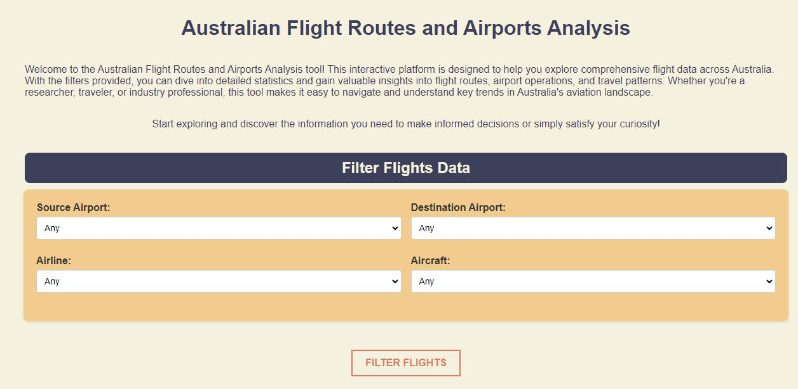
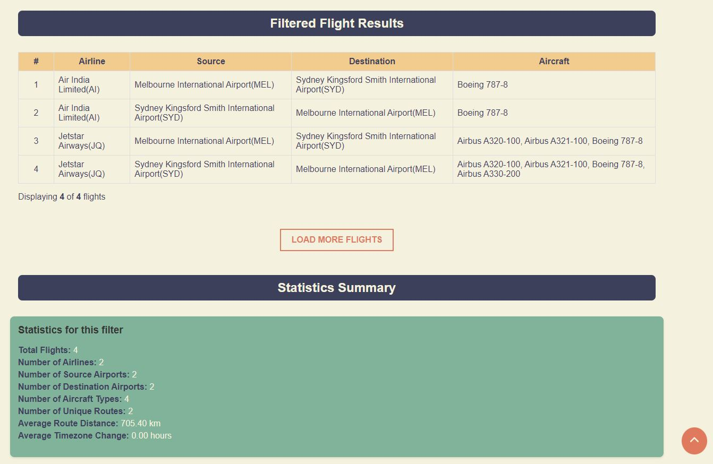
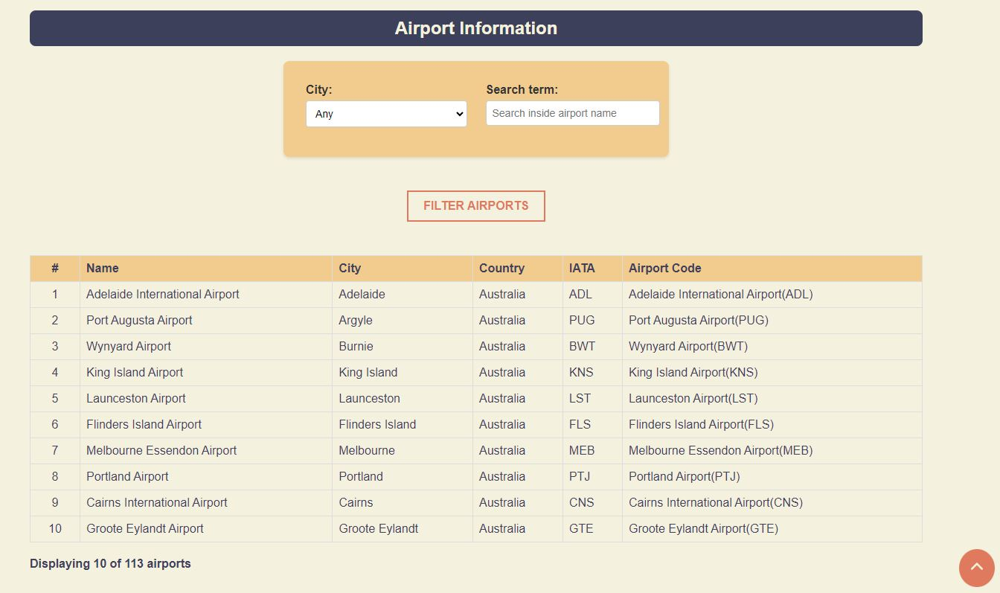
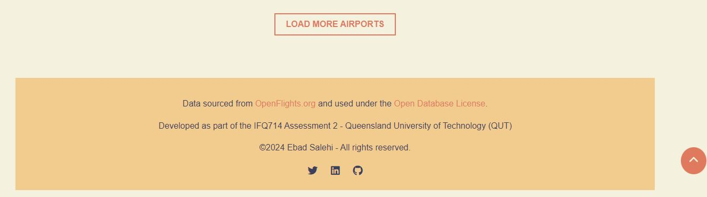

# Flight Route and Airport Analysis Web App
---

This project is a web application designed to analyze and visualize flight routes and airports within Australia. It provides a user-friendly interface for filtering flights, viewing results dynamically, and displaying statistics such as total flights, unique airlines, and average route distance.

## Key Features:

**Frontend in JavaScript:** The interface allows users to filter flights and airports by various criteria (e.g., source/destination, airline, aircraft type), offering dynamic and responsive data updates.

**Backend with Node.js** and Express: The server handles static file serving and routes, fetching and processing flight data for efficient frontend display.

**Flight Statistics:** Built-in functionality calculates and displays important flight metrics like the number of flights and airlines.
User Interaction Enhancements: Features like "Load More" for both flights and airports, and a convenient "Back to Top" button make it easy to explore data.

The project follows a well-organized structure, making it easy to navigate the codebase, extend functionality, and test components.$$


## Screenshots

Here are some screenshots of the application in action:


*Figure 1: The home page of the Flight Route and Airport Analysis Web App*


*Figure 2: Example of flight search and relevant analysis results*


*Figure 3: Detailed airport information display*


*Figure 4: Footer and data source*

# Documentation & Testing
---

## How to Run the application:
make sure you have `node.js` and `Express` installed. if not, install it by running:

```bash
npm install express
```

Run the server:

```bash
node js/server.js
```
and go to [`http://localhost:3000/`](http://localhost:3000/)in the browser to interact with the application.


## Unit Testing

I opted not to use Jest for unit testing because the submission requirements specify the use of `.js` files rather than `.mjs` files, which are typically required for ES module support in Jest. Given the time constraints, I aimed to avoid a fourth refactor of the existing code to align with Jest's module import structure. Instead, I developed custom test functions to ensure full compatibility while preserving the integrity of the original codebase.

Due to the specific nature of certain functions, some are not suitable for automated testing. However, these functions have been carefully designed to handle errors and edge cases gracefully, ensuring that appropriate messages are displayed to the user when needed.

I also have tested the user input field in the UI for harmful text, but due to the use of the `sanitizeInput` function, the text is automatically converted to empty string, so the test will always pass. For this test these scripts were used: 

```html 
<script>alert('XSS Attack!')</script>

<a href="javascript:alert('Malicious Link')">Click me</a>
' OR 1=1 --
<style>body { background-color: red; }</style>
<!-- Comment Injection -->
<div onclick="alert('Event Handler')">Test Div</div>
<input type="text" value="test" onfocus="alert('Focused!')" />
```

### How to run the test:

```bash
node js/unitTest.js
```

### Successful Test Results:

```bash
$ node js/unitTest.js 
Testing getUniqueAirports:
Standard input: PASS

Testing getUniqueAirlines:
Unique airlines: PASS

Testing getUniqueAircraftNames:
Unique aircraft: PASS

Testing filterFlights:
Filtered flights: PASS

Testing calculateDistance:
Known coordinates: PASS

Testing mapDataset:
Mapped dataset: PASS

Testing createMainDataset:
Main dataset creation: PASS

Testing sanitizeInput:
Harmful input: PASS
Normal input: PASS
Empty input: PASS
```

### Error Example (ES Module Warning, fixed afterwards):

```bash
$ node js/unitTest.js
(node:1620) Warning: To load an ES module, set "type": "module" in the package.json or use the .mjs extension.
(Use `node --trace-warnings ...` to show where the warning was created)
.\QUT\IFQ714\V3-Assignment-2\js\unitTest.js:2
import { getUniqueAirports, getUniqueAirlines, getUniqueAircraftNames, filterFlights, calculateDistance } from './dataAnalysis.js';
^^^^^^

(node:1620) Warning: To load an ES module, set "type": "module" in the package.json or use the .mjs extension.
(Use `node --trace-warnings ...` to show where the warning was created)
.\QUT\IFQ714\V3-Assignment-2\js\unitTest.js:2
import { getUniqueAirports, getUniqueAirlines, getUniqueAircraftNames, filterFlights, calculateDistance } from './dataAnalysis.js';
^^^^^^
```

### Functions that could be tested:
- `getUniqueAirports(flights)`
- `getUniqueAirlines(flights)`
- `getUniqueAircraftNames(flights)`
- `filterFlights(dataset, source, destination, airline, aircraft)`
- `calculateDistance(lat1, lon1, lat2, lon2)`
- `mapDataset(dataset, mapFunction)`
- `createMainDataset(updatedFlights, updatedAirports)`

### Functions that could not be tested:
- `populateSelectOptions(data, selectElementId, key, displayFormatter)`
- `displayFilteredFlights({ flights, initialLoad, currentlyDisplayed })`
- `displayAirports(airportsToDisplay)`
- `setupBackToTopButton()`
- `displayStatistics(flights)`
- `setupAirportFilters(airports)`
- `filterAirports(airports, city, searchTerm)`
- `displayFilteredAirports(airports, start, limit)`
- `loadFlights()`
- `loadAirports()`
- `loadMainDataset()`
- `setupUIElements(mainDataset)`
- `setupEventListeners(mainDataset)`
- `filterAndDisplayAirports(mainDataset)`

---

## Documentation

List of functions and their purposes:

## `dataAnalysis.js`
1. **`getUniqueAirports(flights)`**:  
   Extracts and returns a list of unique airports from the provided flight data.

2. **`getUniqueAirlines(flights)`**:  
   Extracts and returns a sorted list of unique airline names from the provided flight data.

3. **`getUniqueAircraftNames(flights)`**:  
   Extracts and returns a sorted list of unique aircraft names from the provided flight data.

4. **`filterFlights(dataset, source, destination, airline, aircraft)`**:  
   Filters the flight dataset based on the specified source, destination, airline, and aircraft criteria.

5. **`calculateDistance(lat1, lon1, lat2, lon2)`**:  
   Calculates the distance between two geographical points given their latitude and longitude.


## `uiHelpers.js`
1. **`populateSelectOptions(data, selectElementId, key, displayFormatter)`**:  
   Populates a dropdown select element with options based on the provided data.

2. **`displayFilteredFlights({ flights, initialLoad, currentlyDisplayed })`**:  
   Displays the filtered flight results in a table format, handling pagination for loading more results.

3. **`displayAirports(airportsToDisplay)`**:  
   Displays a list of airports in a table format.

4. **`setupBackToTopButton()`**:  
   Sets up a button that allows users to scroll back to the top of the page.

5. **`displayStatistics(flights)`**:  
   Calculates and displays various statistics related to the filtered flights.

6. **`setupAirportFilters(airports)`**:  
   Populates the city filter dropdown based on the provided airport data.

7. **`filterAirports(airports, city, searchTerm)`**:  
   Filters the airport data based on the selected city and search term.

8. **`displayFilteredAirports(airports, start, limit)`**:  
   Displays a paginated list of filtered airports.


## `dataMapping.js`
1. **`mapDataset(dataset, mapFunction)`**:  
   Maps over the dataset, applying the provided operation to each element and updating the timestamp.

## `dataLoader.js`
1. **`loadFlights()`**:  
   Fetches and processes flight data from a JSON file, adding an airline_name_code to each flight.

2. **`loadAirports()`**:  
   Fetches and processes airport data from a JSON file, adding an airport_name_code to each airport.

3. **`createMainDataset(updatedFlights, updatedAirports)`**:  
   Combines the updated flights and airports into a main dataset.

4. **`loadMainDataset()`**:  
   Loads both flights and airports, creates the main dataset, and returns it.

5. **`getUniqueAircraftNames(flights)`**:  
   Returns a sorted list of unique aircraft names from the flight data.


## `app.js`
1. **`setupUIElements(mainDataset)`**:  
   Populates dropdowns with unique airports, airlines, and aircraft from the main dataset and displays initial flights.

2. **`setupEventListeners(mainDataset)`**:  
   Sets up event listeners for filtering flights and airports based on user input.

3. **`filterAndDisplayAirports(mainDataset)`**:  
   Filters and displays airports based on the selected city and search term.
